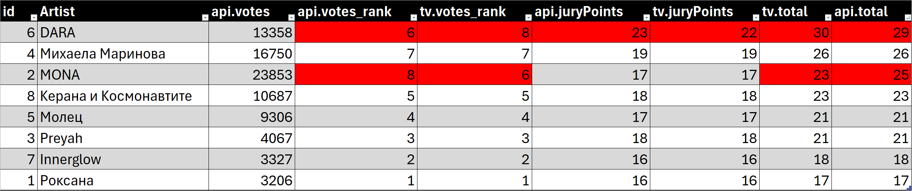
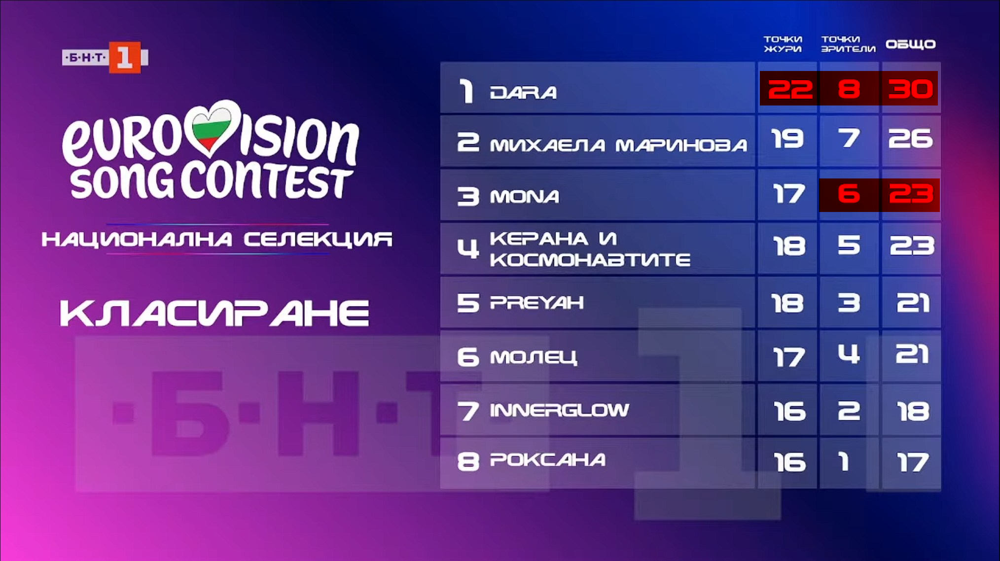

# Eurovision 2026 Bulgaria National Selection - Vote Discrepancy Analysis

This repository contains evidence documenting discrepancies between the official voting results announced on Bulgarian National Television (BNT) during the Eurovision 2026 national selection final and the actual data returned by the voting system's API.

## Background

On the night of January 31, 2026, BNT held the national selection final to choose Bulgaria's representative for Eurovision 2026. After the broadcast, viewers noticed that the voting results API endpoint was still accessible and returning data that appeared to differ from the results announced on television.

> **Note:** The original results API endpoint is no longer available. An archived version can be found at:
> [Web Archive - voteapi31.eurovision2026.bg/results](https://web.archive.org/web/20260201104256/https://voteapi31.eurovision2026.bg/results)

## Evidence

### API Response Data

The file `results-payload.json` contains the JSON response from the official voting API, showing the actual vote counts and jury points for each contestant.

### Comparison with TV Broadcast

The `comparison.xlsx` spreadsheet and `comparison.png` image show a side-by-side comparison of the API data versus the results announced on television. Cells highlighted in red indicate discrepancies.

### Visual Evidence

- `youtube-results.jpg` / `youtube-results-highlighted.png` - Screenshots from the [official BNT YouTube broadcast](https://youtu.be/Oan0V5gDBWw?t=12193) showing the announced results

### Network Traffic Capture

The file `voteapi31.eurovision2026.bg.har` is an HTTP Archive (HAR) file containing the full network request/response to the voting API endpoint, captured on February 1, 2026 at 09:13:42 UTC.

### Social Media Screenshots

The `screenshots-from-social/` directory contains screenshots from social media posts discussing the discrepancies.

*Screenshots are reproduced for documentary purposes. Copyright remains with the original authors.*

## Technical Details

The voting API was hosted at `https://voteapi31.eurovision2026.bg/results` and returned JSON data with:
- Total vote count
- Per-contestant vote counts
- Jury points per contestant
- Voting status and timestamps

The API response was served via Cloudflare and configured with CORS headers allowing requests from `https://vote.eurovision2026.bg`.

## Purpose

This repository serves as a public archive of publicly available data for transparency purposes. The author makes no claims or conclusions about the meaning of any observed differences.

## Disclaimer

Provided "as is" for informational purposes only. No warranties, no claims made. All data was obtained from publicly accessible sources.
